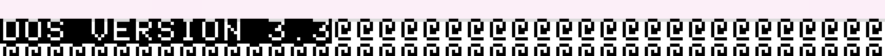
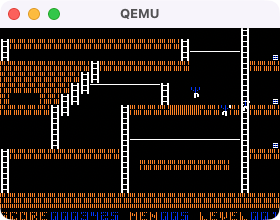
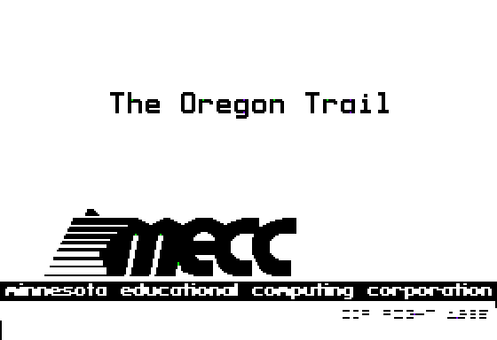

# Bao-Oregon-Trail (baoregon-trail)

> **How vibe-coded is this? VERY!** This is an AI-agent-assisted project
> (Claude/Hermes-driven crew, human in the loop) built by someone who is
> not a microcontroller/embedded-systems expert. Treat claims here with
> appropriate skepticism, expect rough edges, and don't assume any of
> this reflects professional embedded engineering practice.

> **Goal:** get **The Oregon Trail** running natively on the **Baochip-1x** open-silicon RISC-V SoC for the DEF CON 34 badge. We're not there yet — this is a work in progress.

> 🧩 **We're stuck on a real puzzle and could use outside eyes:** Zork I's
> Z-machine interpreter boots and runs genuine, correct code from disk —
> but never prints anything to the screen, and we've ruled out every
> obvious cause (disk-read bugs, CPU bugs, retry loops, keyboard-input
> blocking, timing-model issues). Full writeup, what we've ruled out, and
> what we haven't tried yet: **[Issue #1](../../issues/1)**. If you know
> Zork's Apple II internals or 6502 Z-machine interpreters, we'd love
> your take.

---

## 🌲 Overview

`baoregon-trail` is a bare-metal Apple II / IIe emulator being built for
the **Baochip-1x** (BAO1X2S4F-WA) System-on-Chip designed by Andrew
"bunnie" Huang.

The plan is to leverage the Baochip's **350 MHz Vexriscv RISC-V CPU**,
**4x 700 MHz PicoRV32 BIO coprocessors**, **2.0 MiB SRAM**, and **4.0 MiB
ReRAM** to run classic Apple II software — starting with *The Oregon
Trail* (1985) — **100% on-chip**, with zero external SD cards, zero
external RAM, and instant (<50ms) boot times. Real Baochip-1x hardware
hasn't arrived yet, so none of this has been verified on the actual
target chip — see "Current Status" below for what's actually been tested
so far (host-native and QEMU only).

---

## 💡 Architecture & Tech Stack

```
+-----------------------------------------------------------------------------------+
|                                 BAOCHIP-1X SOC                                    |
|                                                                                   |
|  +--------------------------------+   +----------------------------------------+  |
|  |     VEXRISCV MAIN CPU          |   |        BIO COPROCESSOR CLUSTER         |  |
|  |   350 MHz (RV32-IMAC + MMU)    |   |     4x PicoRV32 @ 700 MHz (RV32-EMC)   |  |
|  | (Executes 6502 CPU & DOS 3.3)  |   |   (Handles Display, Audio & Input)     |  |
|  +--------------------------------+   +----------------------------------------+  |
|                  |                                        |                       |
|                  +--------------------+-------------------+                       |
|                                       |                                           |
|  +------------------------------------+----------------------------------------+  |
|  |  2.0 MiB Internal SRAM             |  4.0 MiB ReRAM (XIP Flash-like Storage)|  |
|  |  - 64 KB Emulated Apple II RAM     |  - Bootloader & Emulator Runtime (~32KB|  |
|  |  - 8 KB Apple II Raw Video Buffer  |  - Apple IIe System Firmware ROM (16 KB)  |  |
|  |  - 150 KB BIO RGB565 Framebuffer   |  - OregonTrail.dsk Floppy Image (140 KB|  |
|  |  - Emulator Stack & Variables      |  - 3.8 MB Free (25+ Extra Apple II Games)|  |
|  +------------------------------------+----------------------------------------+  |
+-----------------------------------------------------------------------------------+
```

---

## 📂 Project Navigation

* 🎯 **[PROJECT_GOALS.md](PROJECT_GOALS.md)** — Core objectives, target milestones, and non-goals.
* 🧠 **[BRAINSTORM.md](BRAINSTORM.md)** — Architectural ideas, video memory un-swizzling on BIO cores, audio hooks, badge input mapping.
* 🚀 **[NEXT_STEPS.md](NEXT_STEPS.md)** — Immediate actionable task list to start building.

---

## ⚡ Quick Specs

* **Emulated System**: Apple II / IIe (MOS 6502 @ 1.023 MHz, 64 KB RAM).
* **Display Output**: 280x192 Apple II Hi-Res graphics scaled & converted to badge display (320x240 / 480x320 RGB565 or monochrome).
* **Audio**: 1-bit Apple II `$C030` speaker toggles synthesized via BIO PWM pin.
* **Storage Requirement**: 0 External Pins (Fully embedded in ReRAM).

---

## 🚧 Current Status (work in progress, hardware not yet in hand)

Nothing here has run on real Baochip-1x silicon yet — hardware is
expected soon. What follows is what's actually been built and tested so
far, host-native and under QEMU only.

635 tests passing (host-native C test suite, `make test`), including a
full pass of the industry-standard **Klaus Dormann 6502 functional test
suite** against our own from-scratch CPU core.

### ✅ Real wins, verified live on QEMU's `ramfb` display

**Apple DOS 3.3 boots and shows its real banner text**, live, on the
emulated RISC-V target under QEMU:



**Lode Runner boots into real, playable-looking Hi-Res graphics** — an
actual 4am-preservationist-cracked disk image, verified twice
independently via `vision_analyze` *without being told what the game
was* (it correctly identified ladders, brick platforms, and a character
sprite matching Lode Runner from the pixels alone):



Both of the above are running as compiled RISC-V machine code under
**QEMU's generic `virt` machine** (`-M virt`), through our own
from-scratch 6502 CPU core, Apple II memory map, Disk ][ nibble/GCR
controller, and `ramfb` display driver — confirmed via live screen
memory reads and screenshots, not assumptions. QEMU's `virt` machine
doesn't model Baochip-1x's actual peripherals (ReRAM, BIO coprocessors,
real display), so this verifies the emulator logic itself is correct,
not that it works on the real chip yet.

There's also a separate, independent reference implementation
([reinette-II-plus](https://github.com/ArthurFerreira2/reinette-II-plus),
vendored MIT-licensed) cross-compiled to RISC-V and booted under QEMU
for cross-checking our own emulator's correctness — see
`NEXT_STEPS.md`'s status summary for details.

### 🧩 Open puzzle: Zork I

Zork I's real Z-machine interpreter boots and runs genuine, correct
6502 code from disk, but never prints anything to the screen within any
cycle budget tested so far. We've ruled out disk-read bugs, CPU bugs,
retry loops, and keyboard-input blocking with real evidence — see
**[Issue #1](../../issues/1)** for the full writeup and an open call
for ideas.

**What's still ahead, and still unverified:** real Baochip-1x hardware
bring-up — BIO Core display-DMA firmware, real button/display wiring,
and confirming the memory map/timing assumptions above actually hold on
silicon. The software side is further along than the hardware
integration; treat everything above as "looks right in simulation, and
now boots real 1980s software," not "works on the badge."

### Screenshot

The real Oregon Trail (1985, MECC) title screen, converted to Apple II
Hi-Res format and rendered through our decode pipeline, run host-side and
under QEMU — not yet on real Baochip-1x hardware:



### Try it yourself

```bash
# Build + run the composed emulator (host-native, no cross-compile needed):
cc -std=c99 -Wall -Wextra -Isrc -DFB_TERMINAL_VIEWER_NO_MAIN \
  -o tools/bin/oregon_trail_runner tools/oregon_trail_runner.c tools/fb_terminal_viewer.c \
  src/apple2_mem.c src/cpu6502.c src/disk_sector_layout.c src/disk_trap.c \
  src/bunnie_audio.c src/video_apple2.c src/bio_display.c src/lores_apple2.c
python3 tools/convert_image_to_hires.py tools/assets/oregon_trail_title.png tools/oregon_trail_hires.bin
cd tools && ca65 oregon_trail_title.s -o oregon_trail_title.o && ld65 -C oregon_trail_title.cfg -o oregon_trail_title.bin oregon_trail_title.o && cd ..
./tools/bin/oregon_trail_runner tools/oregon_trail_title.bin tools/oregon_trail_title_data.bin
```

See `tools/README_oregon_trail.md` for the full pipeline writeup, including
a real bug found and fixed (source/destination memory overlap corrupting
the rendered image).

## 🖥️ Running under an emulator (QEMU / Renode)

Two independent ways to run the real cross-compiled RISC-V build
without physical Baochip-1x hardware:

### QEMU (`virt` machine -- real RISC-V execution, no register-level hardware fault detection)

QEMU's generic `virt` machine runs the real cross-compiled ELF on a
real RISC-V core, with a `ramfb` display and UART -- this is how the
Lode Runner, DOS 3.3, and Zork boot investigations in `NEXT_STEPS.md`
were verified. It does **not** model Baochip-1x's real memory map at
all (`linker-qemu.ld` deliberately uses `virt`'s own RAM at
`0x80000000`, not the real chip's addresses) -- see
`tools/run_loderunner_qemu.sh`, `tools/run_dos33boot_qemu.sh`,
`tools/run_zork1boot_qemu.sh`, `tools/run_disk2boot_qemu.sh` for
working, reproducible build+run scripts.

### Renode (real Baochip-1x memory map + peripheral registers)

`renode/` has a real, working Renode platform for the **actual**
Baochip-1x SoC (not xous-core's existing Precursor-only Renode
support) -- built from the real chip's own SVD via xous-core's
`svd2repl` tool, using the real, corrected ReRAM/SRAM addresses from
`docs/baochip-1x-memory-map-findings.md` (`0x60000000`/`0x61000000`).
This gives register-level peripheral fault detection QEMU's generic
`virt` machine can't provide -- e.g. it would have caught the
SRAM/ReRAM-controller address collision bug (fixed in `144dd81`)
automatically at runtime.

```bash
# macOS Apple Silicon setup -- see renode/MACOS_ARM_SETUP.md for the
# full verified writeup (current status: works, real arm64-native build)
brew tap renode/tap && brew install renode/tap/renode

# Build + run the real MVP demo (real emulator_loop.c running at the
# real 0x60000000 ReRAM entry point, with real console output via a
# modeled DUART peripheral)
bash renode/build_and_run_demo.sh
```

See `renode/README.md` for the full scope writeup (which real
peripherals are modeled and why, which are confirmed NOT real
Baochip-1x SoC peripherals at all, and the two real SVD compatibility
fixes needed for `svd2repl` to accept the chip's real SVD file).

